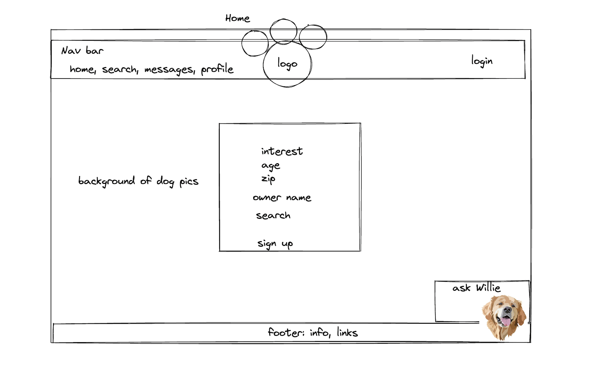
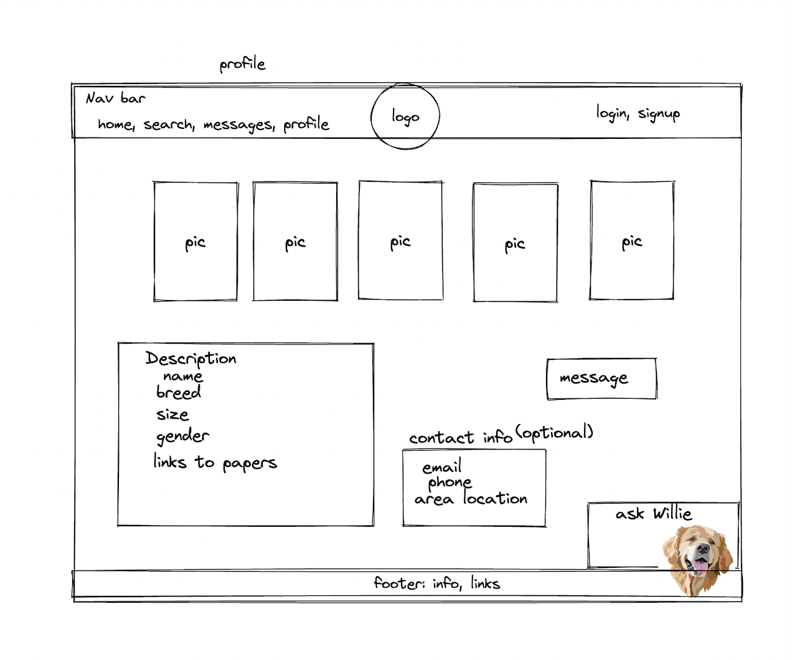
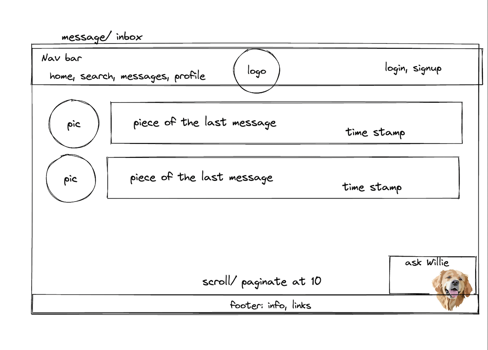
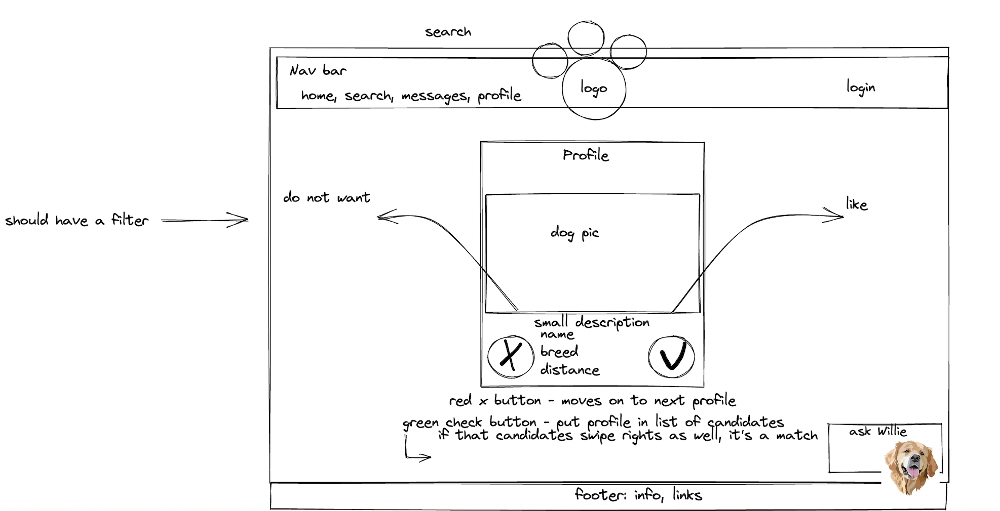

# Graphical Human Interface 
    Contains descriptions of the different screens and how they work with links to low-fidelity drawings
## Home Page

The home page is the main page that users will see upon first visiting the Puppy Love Web Site. It will have a prompt to sign up for the website.

## Profile Page

The personal profile page for each individual user available to view by other users. If the user is logged in and viewing their own personal page there will be options to edit the information visible.

## Message Page

The direct messaging and matches page is used for the Web Site users to view what profile's they have matched with and their history of messages. Users can view the matches' profile upon message expansion.

## Search Page

The search page is for finding new matches. Users will be able to view a minimized version of a dog's profile and can expand it to view the full screen page. Users can click the green checkmark to add the dog to their potential matches or click the red x to deny the dog and see the next profile.

